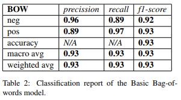
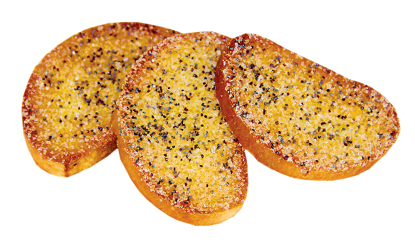

<h1 align='center'>
  Sentiment Analysis on Ingredients 
  
</h1>

## Novel Idea
Often people find themselves in a situation when they wonder if adding a certain component to a meal will improve or worsen its taste. This problem leads to the question of whethera specific ingredient combination tastes delicious or disgusting. This research scrapes and brings together several datasets about various recipes from  worldwide cuisines. Each recipe has a list of ingredients. The goal of this paper is to create a model that can evaluate correctly the tastiness of the ingredient combination. Thus, we call th idea Sentiment Analysis on Ingredients. Imagine people using ingredients to express opinions:

<h3 align='center'>I absolutely loved the movie! It was beef, rice and vinegar!</h3>
<h3 align='center'>This movie is cactus, frog legs and dark chocolate!</h3>

## Data
We gathered data from various sources, so that it represents as many cuisine specific ingredients as possible.
What would happen if you put tzatziki into your orange juice when you don't have tzaziki in your vocabulary?

Another issue was negative examples generation (aim for balanced dataset).
We created recipes with random ingredients sampled from over 8000 different types with a specific length distribution.

One lovely negative recipe worth mentioning:

cactus, morcilla, nonfat buttermilk, soybean sprouts, nectarines, spaghetti, northern beans, black pepper, banana, ton skins, black pepper, pasta sauce, spray, english cucumber, oyster mushrooms, tomato sauce, frogs legs, spam

## Problem
The main problem was how to represent those lists of ingredients in order to best suit our task.

## Models
This research implements four models which reach the following results: 

    

 

    

## Research Future
Our research can find further use in the following areas:
1. <b>Food recommendation systems</b>
2. <b>Recipe generation systems</b>
3. <b>Food industry awareness</b>
